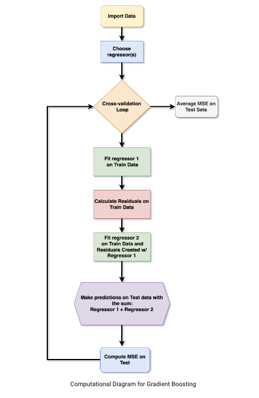

# Project 3

Nitu Girish Mohan

In this project, I will be looking at the Gradient Boosting Algorithm, testing the Boosted Locally Weighted Regressor on different datasets/kernels, and using complete KFold cross validations to compare with other regressors.


## Gradient Boosting
Let's start by discussing Gradient Boosting, a boosting technique in machine learning that operates on the principle of minimizing the total prediction error by combining the best possible subsequent model with the previous models. The crucial aspect is to establish target outcomes for the next model to minimize the error. This approach generates a predictive model composed of a collection of weak prediction models, usually decision trees. When a decision tree functions as the weak learner, the resulting algorithm is known as gradient-boosted trees, and it frequently outperforms random forest (which we'll demonstrate later in the code).
 
Assume you have an regressor $F$ and, for the observation $x_i$ we make the prediction $F(x_i)$. To improve the predictions, we can regard $F$ as a 'weak learner' and therefore train a decision tree (we can call it $h$) where the new output is $y_i-F(x_i)$. So, the new predictor is trained on the residuals of the previous one. Thus, there are increased chances that the new regressor

$$\large F + h$$ 

is better than the old one, $F.$

Main task: implement this idea in an algorithm and test it on real data sets.

The algorithm follows the order of the structure below:

 

Importing necessary libraries
```python
# computational libraries
import numpy as np
import pandas as pd
from sklearn.linear_model import LinearRegression, Ridge
from sklearn.preprocessing import StandardScaler, QuantileTransformer, MinMaxScaler, PolynomialFeatures
from sklearn.decomposition import PCA
from scipy.spatial import Delaunay
from sklearn.ensemble import RandomForestRegressor
from sklearn.pipeline import Pipeline
import scipy.stats as stats 
from sklearn.model_selection import train_test_split as tts, KFold, GridSearchCV
from sklearn.metrics import mean_squared_error as mse
from scipy.interpolate import interp1d, RegularGridInterpolator, griddata, LinearNDInterpolator, NearestNDInterpolator
from math import ceil
from scipy import linalg
from scipy.linalg import lstsq
# the following line(s) are necessary if you want to make SKlearn compliant functions
from sklearn.base import BaseEstimator, RegressorMixin
from sklearn.utils.validation import check_X_y, check_array, check_is_fitted
import xgboost as xgb
scale = StandardScaler()
```

To implement the Gradient Boosting algorithm with user defined choices for Regressor_1 and Regressor_2 we will do the following. First we'll start with the boosted regressor implementation from class.

```python
def boosted_lwr(x, y, xnew, f=1/3,iter=2,intercept=True):
  # we need decision trees
  # for training the boosted method we use x and y
  model1 = Lowess_AG_MD(f=f,iter=iter,intercept=intercept) # we need this for training the Decision Tree
  model1.fit(x,y)
  residuals1 = y - model1.predict(x)
  model2 = Lowess_AG_MD(f=f,iter=iter,intercept=intercept)
  #model2 = RandomForestRegressor(n_estimators=200,max_depth=9)
  model2.fit(x,residuals1)
  output = model1.predict(xnew) + model2.predict(xnew)
  return output 
 ```
 
 We will now change it slightly to take user-defined choices for each of the regressors for model1 and model2. 
 
 ```python
 def user_boosted_lwr(x, y, xnew, f=1/3, iter=2, intercept=True, model1_type="Lowess_AG_MD", model2_type="Lowess_AG_MD"):
    # Define the first model for training the decision tree
    if model1_type == "Lowess_AG_MD":
        model1 = Lowess_AG_MD(f=f, iter=iter, intercept=intercept)
    elif model1_type == "RandomForestRegressor":
        model1 = RandomForestRegressor(n_estimators=200,max_depth=5)
    else:
        raise ValueError("please choose 'Lowess_AG_MD' or 'RandomForestRegressor'.")
    model1.fit(x, y)
    residuals1 = y - model1.predict(x)
    
    # Define the second model for fitting the residuals
    if model2_type == "Lowess_AG_MD":
        model2 = Lowess_AG_MD(f=f, iter=iter, intercept=intercept)
    elif model2_type == "RandomForestRegressor":
        model2 = RandomForestRegressor(n_estimators=200,max_depth=5)
    else:
        raise ValueError("please choose 'Lowess_AG_MD' or 'RandomForestRegressor'.")

    model2.fit(x, residuals1)
    output = model1.predict(xnew) + model2.predict(xnew)
    return output
```

To demonstrate, we will look at it using the concrete dataset (using the distance function, kernels, and Lowess_AG_MD defined in class) :

```python
data = pd.read_csv('/content/drive/MyDrive/22 23 - Junior Yr/Adv Applied Machine Learning/1. Preliminaries, Intro to Locally Weighted Regression/concrete.csv')
data

x = data.loc[:,'cement':'age'].values
y = data['strength'].values

xtrain, xtest, ytrain, ytest = tts(x,y,test_size=0.3,shuffle=True,random_state=123)

yhat = user_boosted_lwr(xtrain, ytrain, xtest,f=25/len(xtrain),iter=1,intercept=True, model1_type="Lowess_AG_MD", model2_type="Lowess_AG_MD")

mse(ytest,yhat)
```
57.73151261936397

I will now try it with the RandomForestRegressor.

```python
yhat = user_boosted_lwr(xtrain, ytrain, xtest,f=25/len(xtrain),iter=1,intercept=True, model1_type="Lowess_AG_MD", model2_type="RandomForestRegressor")

mse(ytest,yhat)
```
42.90724190818058


## Boosted Locally Weighted Regressor Testing with K-Fold Crossvalidations
I will now test the Boosted Locally Weighted Regressor with different choices of data (such as "cars.csv", "concrete.csv" and "housing.csv") and different choice of kernels, such as Gaussian, Tricubic, Epanechnikov and Quartic.

These are the datasets I will use:

```python
# load in the datasets
housing = pd.read_csv('/content/drive/MyDrive/22 23 - Junior Yr/Adv Applied Machine Learning/4. Variable Selection, Feature Engineering and Neural Networks/housing.csv')
concrete = pd.read_csv('/content/drive/MyDrive/22 23 - Junior Yr/Adv Applied Machine Learning/1. Preliminaries, Intro to Locally Weighted Regression/concrete.csv')
```

For this project, I will be looking at kernel options of tricubic, quartic, and Epanechnikov.

```python
# Tricubic Kernel
def Tricubic(x):
  if len(x.shape) == 1:
    x = x.reshape(-1,1)
  d = np.sqrt(np.sum(x**2,axis=1))
  return np.where(d>1,0,70/81*(1-d**3)**3)

# Quartic Kernel
def Quartic(x):
  if len(x.shape) == 1:
    x = x.reshape(-1,1)
  d = np.sqrt(np.sum(x**2,axis=1))
  return np.where(d>1,0,15/16*(1-d**2)**2)

# Epanechnikov Kernel
def Epanechnikov(x):
  if len(x.shape) == 1:
    x = x.reshape(-1,1)
  d = np.sqrt(np.sum(x**2,axis=1))
  return np.where(d>1,0,3/4*(1-d**2)) 
 ```
 
 This is the regressor and boosted regressor I will be comparing (adapted from class notebooks):
 
 ```python
 #Defining the kernel local regression model

def lw_reg(X, y, xnew, kern, tau, intercept):
    # tau is called bandwidth K((x-x[i])/(2*tau))
    n = len(X) # the number of observations
    yest = np.zeros(n)

    if len(y.shape)==1: # here we make column vectors
      y = y.reshape(-1,1)

    if len(X.shape)==1:
      X = X.reshape(-1,1)
    
    if intercept:
      X1 = np.column_stack([np.ones((len(X),1)),X])
    else:
      X1 = X

    w = np.array([kern((X - X[i])/(2*tau)) for i in range(n)]) # here we compute n vectors of weights

    #Looping through all X-points
    for i in range(n):          
        W = np.diag(w[:,i])
        b = np.transpose(X1).dot(W).dot(y)
        A = np.transpose(X1).dot(W).dot(X1)
        #A = A + 0.001*np.eye(X1.shape[1]) # if we want L2 regularization
        #theta = linalg.solve(A, b) # A*theta = b
        beta, res, rnk, s = lstsq(A, b)
        yest[i] = np.dot(X1[i],beta)
    if X.shape[1]==1:
      f = interp1d(X.flatten(),yest,fill_value='extrapolate')
    else:
      f = LinearNDInterpolator(X, yest)
    output = f(xnew) # the output may have NaN's where the data points from xnew are outside the convex hull of X
    if sum(np.isnan(output))>0:
      g = NearestNDInterpolator(X,y.ravel()) 
      # output[np.isnan(output)] = g(X[np.isnan(output)])
      output[np.isnan(output)] = g(xnew[np.isnan(output)])
    return output
   ```
   
   ```python
 def boosted_lwr(X, y, xnew, kern, tau, intercept):
  model1 = lw_reg(X,y,X,kern,tau,intercept) # we need this for training the Decision Tree
  residuals = y - model1
  model2 = RandomForestRegressor(n_estimators=100,max_depth=2)
  model2.fit(X,residuals)
  output = model2.predict(xnew) + lw_reg(X,y,xnew,kern,tau,intercept)
  return output 
```

Let's first try it with the concrete data with the Epanechnikov kernel.

```python
x = concrete.loc[:,'cement':'age'].values
y = concrete['strength'].values
```
```python
mse_lwr = []
mse_boosted_lwr = []
kf = KFold(n_splits=10,shuffle=True,random_state = 310)
for idxtrain, idxtest in kf.split(X):
  xtrain = X[idxtrain]
  ytrain = y[idxtrain]
  ytest = y[idxtest]
  xtest = X[idxtest]
  xtrain = scale.fit_transform(xtrain)
  xtest = scale.transform(xtest)
  yhat_lwr = lw_reg(xtrain,ytrain, xtest,Epanechnikov,tau=0.9,intercept=True)
  yhat_blwr = boosted_lwr(xtrain,ytrain, xtest,Epanechnikov,tau=0.9,intercept=True)
  mse_lwr.append(mse(ytest,yhat_lwr))
  mse_boosted_lwr.append(mse(ytest,yhat_blwr))
print('The Cross-validated Mean Squared Error for lw_reg is : '+str(np.mean(mse_lwr)))
print('The Cross-validated Mean Squared Error for boosted_lw_reg is : '+str(np.mean(mse_boosted_lwr)))
```
The Cross-validated Mean Squared Error for lw_reg is : 261.9172057655939

The Cross-validated Mean Squared Error for boosted_lw_reg is : 254.10545711938212


Now lets try it with a Tricubic kernel.

```python
mse_lwr = []
mse_boosted_lwr = []
kf = KFold(n_splits=10,shuffle=True,random_state = 310)
scale = StandardScaler()
for idxtrain, idxtest in kf.split(X):
  xtrain = X[idxtrain]
  ytrain = y[idxtrain]
  ytest = y[idxtest]
  xtest = X[idxtest]
  xtrain = scale.fit_transform(xtrain)
  xtest = scale.transform(xtest)
  yhat_lwr = lw_reg(xtrain,ytrain, xtest,Tricubic,tau=0.9,intercept=True)
  yhat_blwr = boosted_lwr(xtrain,ytrain, xtest,Tricubic,tau=0.9,intercept=True)
  mse_lwr.append(mse(ytest,yhat_lwr))
  mse_boosted_lwr.append(mse(ytest,yhat_blwr))
print('The Cross-validated Mean Squared Error for lw_reg is : '+str(np.mean(mse_lwr)))
print('The Cross-validated Mean Squared Error for boosted_lw_reg is : '+str(np.mean(mse_boosted_lwr)))
```
The Cross-validated Mean Squared Error for lw_reg is : 261.6978107579365

The Cross-validated Mean Squared Error for boosted_lw_reg is : 255.78521768269502


Next, let's try it with the housing data with the Epanechnikov kernel.

```python
X = housing[['lstat', 'rooms', 'distance']].values
y = housing['cmedv'].values
```

```python
mse_lwr = []
mse_boosted_lwr = []
kf = KFold(n_splits=10,shuffle=True,random_state = 310)
for idxtrain, idxtest in kf.split(X):
  xtrain = X[idxtrain]
  ytrain = y[idxtrain]
  ytest = y[idxtest]
  xtest = X[idxtest]
  xtrain = scale.fit_transform(xtrain)
  xtest = scale.transform(xtest)
  yhat_lwr = lw_reg(xtrain,ytrain, xtest,Epanechnikov,tau=0.9,intercept=True)
  yhat_blwr = boosted_lwr(xtrain,ytrain, xtest,Epanechnikov,tau=0.9,intercept=True)
  mse_lwr.append(mse(ytest,yhat_lwr))
  mse_boosted_lwr.append(mse(ytest,yhat_blwr))
print('The Cross-validated Mean Squared Error for lw_reg is : '+str(np.mean(mse_lwr)))
print('The Cross-validated Mean Squared Error for boosted_lw_reg is : '+str(np.mean(mse_boosted_lwr)))
```
The Cross-validated Mean Squared Error for lw_reg is : 23.03885019369726

The Cross-validated Mean Squared Error for boosted_lw_reg is : 21.79843470960379


Now lets try it with a Quartic kernel.
```python
mse_lwr = []
mse_boosted_lwr = []
kf = KFold(n_splits=10,shuffle=True,random_state = 310)
scale = StandardScaler()
for idxtrain, idxtest in kf.split(X):
  xtrain = X[idxtrain]
  ytrain = y[idxtrain]
  ytest = y[idxtest]
  xtest = X[idxtest]
  xtrain = scale.fit_transform(xtrain)
  xtest = scale.transform(xtest)
  yhat_lwr = lw_reg(xtrain,ytrain, xtest,Quartic,tau=0.9,intercept=True)
  yhat_blwr = boosted_lwr(xtrain,ytrain, xtest,Quartic,tau=0.9,intercept=True)
  mse_lwr.append(mse(ytest,yhat_lwr))
  mse_boosted_lwr.append(mse(ytest,yhat_blwr))
print('The Cross-validated Mean Squared Error for lw_reg is : '+str(np.mean(mse_lwr)))
print('The Cross-validated Mean Squared Error for boosted_lw_reg is : '+str(np.mean(mse_boosted_lwr)))
```
The Cross-validated Mean Squared Error for lw_reg is : 22.723935874668843

The Cross-validated Mean Squared Error for boosted_lw_reg is : 21.254084109129884


# References:
1. https://www.displayr.com/gradient-boosting-the-coolest-kid-on-the-machine-learning-block/
2. https://en.wikipedia.org/wiki/Gradient_boosting
3. Class Notebooks
